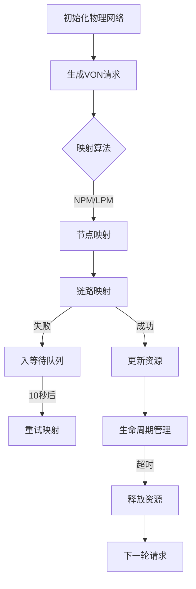

# EON-RSW-Optimize---弹性光网络的算法研究-基于LPM-NPM的算法优化

添加：
### 1.动态资源回收机制 --每一次服务时会释放列表里已经过了生存期的服务
### 2.双资源池策略 --将链路资源按照一定的比例氛围两路资源池，为应对不同情况的下的业务有序，降低多数服务阻塞次数
### 3.动态编码格式 --跟据不同的链路长度情况，采用不失真，提升传输效率，减少链路开销
### 4.重复生存期策略 --第一次未能成功完成链路放置的服务，将存放在备用列表里，等到下一次的放置时若还在生存期内，则可以再次尝试放置
### 5.碎片化感知 --增加碎片化的权重，综合Dijkstra，选择更优的路径

## 工作流程

以下图示展示了本项目的核心工作流程：

## 代码使用指南
### 实验里优化过后的代码在2.RSW文件夹中，其中包含了美国与意大利两种的网络。Original—LPM&NPM是基础的不带优化的模型，用于作为比对
### 需要预先安装好的库
`pip install networkx , numpy`
> 其余的文件均为学习过程中的备份或者历史代码。

> [!note]
> 本人负责部分已经导师同意过后开源，代码上可能有所缺陷请各位老师们多多指教。由于DQN/ILP部分并非我一人完成，组内讨论过后暂时不便全部公开，故留下了我学习时测试的代码

> 最后感谢我的导师-赵老师，从我大二时开始指导，为我讲解领域知识与提供问题指导；也感谢我的组里成员们，每次组会都会分享且提供新的思路，学长们也会为我提供专业的学习建议；也感谢上海工程技术大学电子电气工程学院，培养了我专业的基础知识与代码能力。笔者代码可能有部分错误，本人终究也还是光通信领域的小白，路漫漫其修远兮，我当继续不断学习与创新
