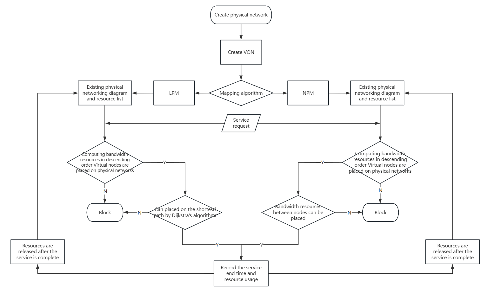

# EON-RSW-Optimize --- 弹性光网络的算法研究-基于LPM-NPM的算法优化

本项目针对弹性光网络（EON）中的路由与频谱分配（RSA）问题，提出了一系列优化算法，包括动态资源回收机制、双资源池策略、动态编码格式、重复生存期策略和碎片化感知。这些优化旨在降低业务阻塞率，提高网络资源利用率。

## 主要优化策略

### 1. 动态资源回收机制
在每一次服务时，释放资源列表中已经过了生存期的服务，及时回收资源。
```
def recover_resources(aux_network, von_mappings):
    global end_times
    current_time = min(end_times) if end_times else float('inf')
    while end_times and end_times[0] <= current_time:
        end_time = end_times.pop(0)
        recover_resources_at_time(aux_network, von_mappings, end_time)

def recover_resources_at_time(aux_network, von_mappings, end_time):
    for von_number, mapping in list(von_mappings.items()):
        # 识别需要移除的节点
        nodes_to_remove = [vn_id for vn_id, pn_id in mapping['node_mappings'].items() 
                          if aux_network.nodes[pn_id].get('end_time') == end_time]
        
        # 释放节点资源
        for vn_id in nodes_to_remove:
            pn_id = mapping['node_mappings'][vn_id]
            aux_network.nodes[pn_id]['computing_resource'] += mapping['node_mappings'][vn_id]['computing_resource']
            del mapping['node_mappings'][vn_id]
            
            # 释放关联链路资源
            links_to_remove = [link for link in mapping['link_mappings'] if vn_id in link]
            for link in links_to_remove:
                for u, v in zip(mapping['link_mappings'][link][:-1], mapping['link_mappings'][link][1:]):
                    aux_network[u][v]['capacity'] += mapping['link_mappings'][link]['bandwidth']
                del mapping['link_mappings'][link]
```

### 2. 双资源池策略
将链路资源按照一定比例分为两路资源池，以应对不同情况下的业务需求，从而降低多数服务的阻塞次数。
```
def try_with_backup(aux_network, von_mappings, von_number, vn_source, vn_target, data):
    # 计算备用资源池容量（总容量的30%）
    backup_capacity = 0.3 * sum(data['capacity'] for _, _, data in aux_network.edges(data=True))
    
    # 检查备用资源是否足够
    if backup_capacity >= data['bandwidth']:
        for u, v in aux_network.edges():
            if aux_network[u][v]['capacity'] >= data['bandwidth']:
                # 使用备用资源
                aux_network[u][v]['capacity'] -= data['bandwidth']
                von_mappings[von_number]['link_mappings'][(vn_source, vn_target)] = [(vn_source, vn_target)]
                
                # 记录资源使用
                global total_capacity_used
                total_capacity_used += data['bandwidth']
                return True
    return False
```
### 3. 动态编码格式
根据不同的链路长度情况，采用不失真的编码格式，提升传输效率，减少链路开销。
```
def map_link_with_dynamic_coding(aux_network, path, bandwidth):
    total_path_length = sum(aux_network[u][v]['length'] for u, v in zip(path[:-1], path[1:]))
    
    # 根据路径长度动态调整带宽需求
    if total_path_length < 80:
        adjusted_bandwidth = bandwidth / 6
    elif 80 < total_path_length < 240:
        adjusted_bandwidth = bandwidth / 5
    elif 240 < total_path_length < 560:
        adjusted_bandwidth = bandwidth / 4
    elif 560 < total_path_length < 1360:
        adjusted_bandwidth = bandwidth / 3
    elif 1360 < total_path_length < 2720:
        adjusted_bandwidth = bandwidth / 2
    elif total_path_length > 2720:
        adjusted_bandwidth = bandwidth
        
    return adjusted_bandwidth
```
### 4. 重复生存期策略
第一次未能成功完成链路放置的服务，将存放在备用列表里。若在生存期内再次尝试放置时，服务仍然存在，则可重新尝试放置。
```
def process_waiting_queue(aux_network, waiting_queue):
    global end_times
    current_time = min(end_times) if end_times else float('inf')
    
    for entry in list(waiting_queue):
        von_number, vn_source, vn_target, data, start_wait_time = entry
        
        # 检查是否仍在生存期内
        if current_time - start_wait_time < WAIT_TIME:
            continue
            
        # 从等待队列中移除
        waiting_queue.remove(entry)
        
        # 尝试重新映射
        pn_source = von_mappings[von_number]['node_mappings'].get(vn_source)
        pn_target = von_mappings[von_number]['node_mappings'].get(vn_target)
        best_path = find_best_path(aux_network, pn_source, pn_target, data['bandwidth'])
        
        if best_path:
            # 使用动态编码格式计算实际带宽需求
            adjusted_bandwidth = map_link_with_dynamic_coding(aux_network, best_path, data['bandwidth'])
            
            # 分配资源
            for i in range(len(best_path) - 1):
                aux_network[best_path[i]][best_path[i + 1]]['capacity'] -= adjusted_bandwidth
                
            von_mappings[von_number]['link_mappings'][(vn_source, vn_target)] = best_path
```
### 5. 碎片化感知
增加碎片化的权重，结合Dijkstra算法，选择更优的路径，减少频谱碎片。
```

```
## 工作流程

以下图示展示了本项目的核心工作流程：


## 代码使用指南

实验里优化过后的代码在`2.RSW`文件夹中，其中包含了美国与意大利两种网络。`Original—LPM&NPM`是基础的不带优化的模型，用于作为比对。

### 依赖安装
运行代码前，请确保安装以下Python库：
```bash
pip install networkx numpy  
```


> 其余的文件均为学习过程中的备份或者历史代码。

> [!note]
> 本人负责部分已经导师同意过后开源，代码上可能有所缺陷请各位老师们多多指教。由于DQN/ILP部分并非我一人完成，组内讨论过后暂时不便全部公开，故留下了我学习时测试的代码

> 最后感谢我的导师-赵老师，从我大二时开始指导，为我讲解领域知识与提供问题指导；也感谢我的组里成员们，每次组会都会分享且提供新的思路，学长们也会为我提供专业的学习建议；也感谢上海工程技术大学电子电气工程学院，培养了我专业的基础知识与代码能力。笔者代码可能有部分错误，本人终究也还是光通信领域的小白，路漫漫其修远兮，我当继续不断学习与创新
